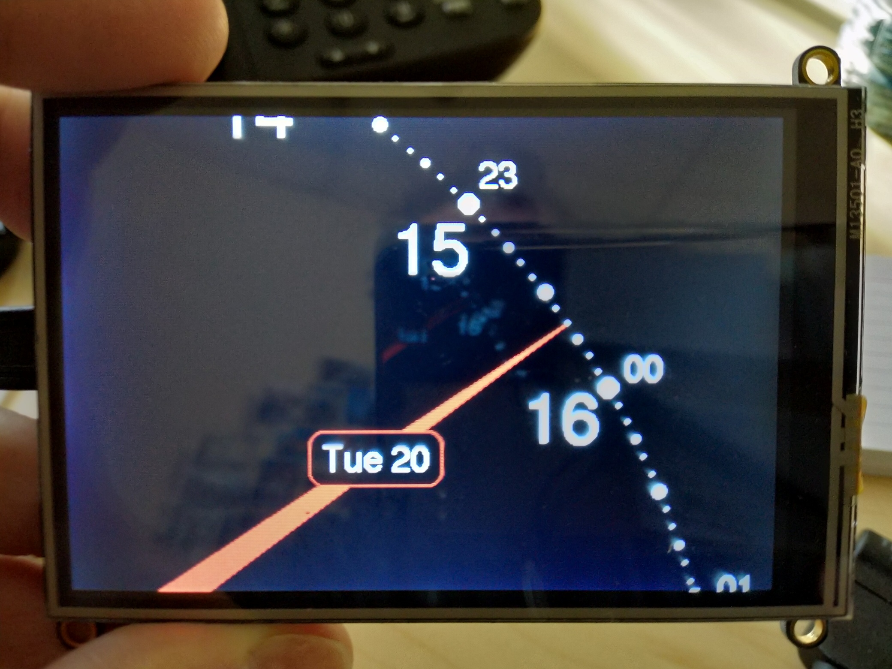

# Arduino ESP8266 + 3.5" TFT clock

Arduino clock based on https://github.com/gregoiresage/hop-picker -- a different
take on an analog clock. Shows the time on a 24 hour dial, current date, and
time in a second timezone. The time is synchronized via NTP every minute.

Not as configurable as the original, but comes with a 3D file for a stand.

Hardware used:
- Display: https://www.adafruit.com/product/3651
- Processor: https://www.adafruit.com/product/3046

Uses the adafruit GFX library.
